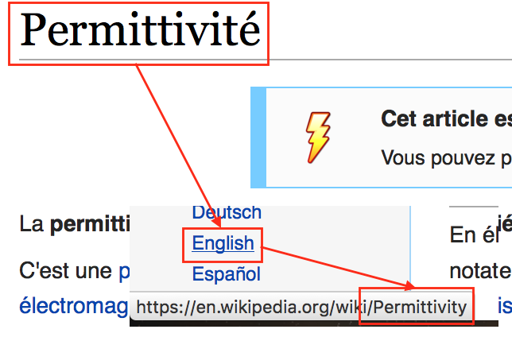

# WikiTranslate

[](https://circleci.com/gh/wikitranslate/wikitranslate/tree/master)

Ask experts from around the globe to find the exact translation for technical terms.
Not only is Wikipedia a great source of knowledge, it's also a great translation tool !



This package provides a translation module.

## Usage

 - Install it: `yarn add wikitranslate`
 - Require it: `let wikiTranslate = require('wikitranslate');`
 - Use it:

  ```js
  wikiTranslate('Permittivité', 'fr', 'en')
  .then((translations) => {
    console.log(translation); // { wikipedia: ['Permittivity'], wiktionary: ['Permittivity'] }
  })
  ```
